# Payment Reconciliation Pipeline

Reconciles payment-engine records against PayPal, Adyen, dLocal and Google Play exports, explains differences in USD and checks contracted fees.

**Final report is here: [June 2026 findings and actions](outputs/findings.md).**

| Reports | Summary | Discrepancy details |
|---|---|---|
| Payments before fees | [Provider × cause](outputs/reconciliation_summary.csv) | [Transactions](outputs/reconciliation_details.csv) |
| Fees | [Contract comparison](outputs/fee_reconciliation_summary.csv) | [Transactions](outputs/fee_reconciliation_details.csv) |

## How the pipeline works

```mermaid
flowchart LR
    INPUT[CSV snapshots]

    subgraph RAW[RAW]
        R[Load source columns<br/>as text]
    end

    subgraph STAGING[STAGING]
        S[Parse types, amounts<br/>and UTC timestamps]
        D[Remove confirmed<br/>exact copies]
        S --> D
    end

    subgraph INTERMEDIATE[INTERMEDIATE]
        N[Map sources to common<br/>engine, event and fee contracts]
        X[Value provider events<br/>with reported or reference FX]
        M[Apply provider-specific<br/>one-to-one matching]
        N --> X
        X --> M
    end

    subgraph MARTS[MARTS]
        P[Keep matched, engine-only<br/>and provider-only events]
        C[Apply UTC month, measure<br/>USD impact and assign cause]
        A[Aggregate payments<br/>by provider and cause]
        F[Select effective tariff<br/>and compare reported fees]
        P --> C --> A
    end

    subgraph OUTPUTS[OUTPUTS]
        O[Payment and fee<br/>summaries and details]
    end

    INPUT --> R --> S
    D --> N
    M --> P
    X --> F
    A --> O
    F --> O
```



Match full extracts before applying the month boundary, preserving late settlements and unmatched events. Amounts are comparison fields, not matching keys. Signed payment impact is **provider − engine**; fees are separate.

| Provider | Matching rule |
|---|---|
| PayPal US / EU, dLocal | PSP reference |
| Adyen | PSP reference for sales; order + operation for refunds and chargebacks |
| Google Play | UTC completion timestamp + operation + product + country + currency; one-to-one candidates only |

Tests check identity, matching cardinality, required data and source-to-report totals. Invalid inputs block report export.

## Where to look

- **Payment calculation:** [mart_reconciliation_detail.sql](dbt/models/marts/payments/mart_reconciliation_detail.sql) — unmatched events, period scope, USD impact and cause.
- **Fee calculation:** [mart_fee_reconciliation_detail.sql](dbt/models/marts/fees/mart_fee_reconciliation_detail.sql) — reported fees versus the effective contract.
- **Provider rules:** [intermediate/providers/](dbt/models/intermediate/providers) — `events`, `matches` and `fees` per provider. Shared models sit directly in `intermediate/`.

## Repository layout

```text
raw/                         input snapshots
outputs/                     generated summaries, details and findings
dbt/
├── models/
│   ├── raw/                 source loading
│   ├── staging/             source parsing and deduplication
│   ├── intermediate/        common contracts, FX and unions
│   │   └── providers/       provider-specific events, fees and matches
│   └── marts/
│       ├── payments/        payment reconciliation
│       └── fees/            fee reconciliation
├── tests/                   data quality checks
└── models/schema.yml        model grains, fields and standard tests
run_pipeline.py              build, test and CSV export
```

## Stack

Python 3.13 · DuckDB · dbt

## Run
```bash
python3 -m venv .venv
source .venv/bin/activate
python -m pip install -r requirements.txt
python run_pipeline.py --report-month 2026-06-01
```

The runner builds and tests all models, then refreshes four CSV reports in `outputs/`. The findings note is a written analysis. Disconnect other DuckDB clients before running.
